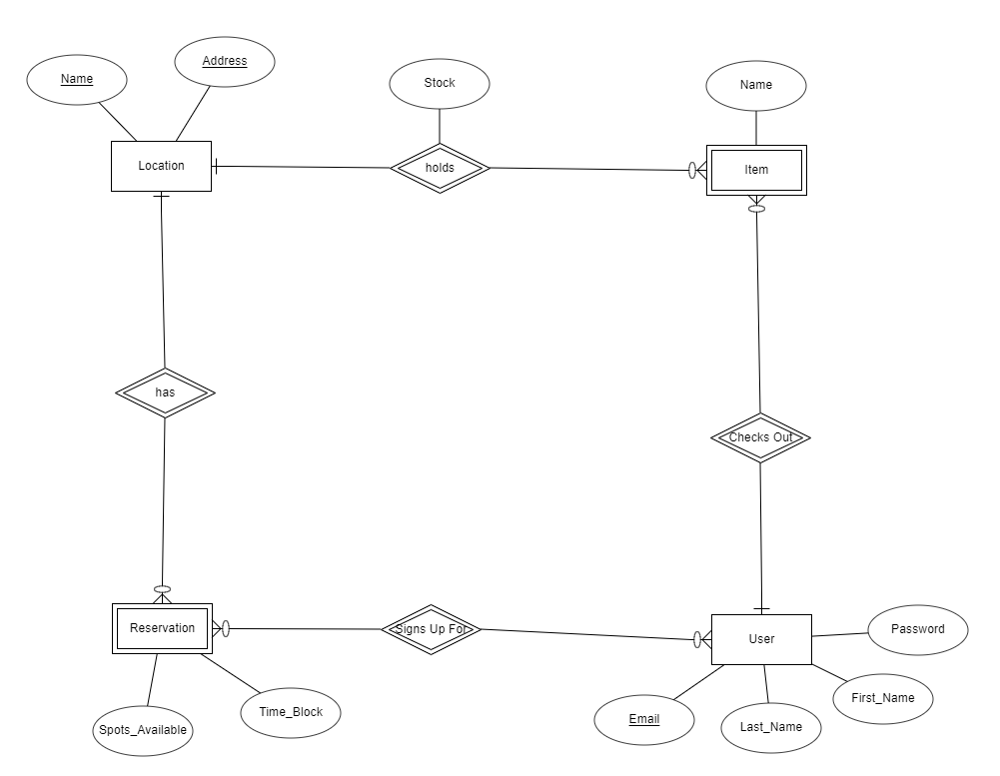

# Welcome to our database final project

## Contributors
- Patrick O'Shea
- Yaniv Kovalski
- Parker Rowley

## To clone the repository

```
git clone https://github.com/oshea-patrick/database_management.git
```

## To install the required modules

```
cd database_management
npm i
```

## To start the project in your window (live reload)

```
npm start
```

## Stack implmentation
Frontend: Nodejs/React (hosted locally)
<br/>
Backend: Python3/Flask hosted at 18.221.103.54:5000
<br/>
Database: Oracle hosted at csc325spring2021.cjjvanphib99.us-west-2.rds.amazonaws.com:1521
<br/>

## API Methods

URL: ENDPOINT/getUser
<br/>
METHOD: POST
<br/>
body : {
<br/>
    "email" : "",
<br/>
    "first_name" : "",
<br/>
    "last_name" : "",
<br/>
    "password" : ""
<br/>
}
<br/>
Response on Success: [true, {"email": "hpotter1@students.hogwarts.edu", "first_name": "Harry1", "last_name": "Potter", "password": "test"}]
<br/>
Response on Failure: [false, ""]
<br/>
<br/>

URL: ENDPOINT/signup
<br/>
METHOD: POST
<br/>
body : {
<br/>
    "email" : "",
<br/>
    "first_name" : "",
<br/>
    "last_name" : "",
<br/>
    "password" : ""
<br/>
}
<br/>
Response on Success: 'Success'
<br/>
Response on Failure: 'Failed'
<br/>
<br/>

URL: ENDPOINT/getLocations
<br/>
METHOD: POST
<br/>
body : no body
<br/>
Response on Success: [location object, ...]
<br/>
Response on Failure: Error
<br/>
<br/>

URL: ENDPOINT/getReservations
<br/>
METHOD: POST
<br/>
body : no body
<br/>
Response on Success: [reservation object, ...]
<br/>
Response on Failure: Error
<br/>
<br/>

URL: ENDPOINT/joinReservation
<br/>
METHOD: POST
<br/>
body : {
<br/>
    "email" : "",
<br/>
    "time_block" : "",
<br/>
    "location_name" : "",
<br/>
    "address" : ""
<br/>
}
<br/>
Response on Success: 'Success'
<br/>
Response on Failure: 'Failed'
<br/>
<br/>

URL: ENDPOINT/getRegisteredReservations
<br/>
METHOD: POST
<br/>
body : no body
<br/>
Response on Success: [sign object, ...]
<br/>
Response on Failure: Error
<br/>
<br/>

URL: ENDPOINT/getItems
<br/>
METHOD: POST
<br/>
body : no body
<br/>
Response on Success: [item object, ...]
<br/>
Response on Failure: Error
<br/>
<br/>

URL: ENDPOINT/checkoutItem
<br/>
METHOD: POST
<br/>
body : {
<br/>
    "item_name" : "",
<br/>
    "location" : "",
<br/>
    "email" : ""
<br/>
}
<br/>
Response on Success: 'Success'
<br/>
Response on Failure: 'Failed'
<br/>
<br/>

## Database Diagram



## Database Schema


